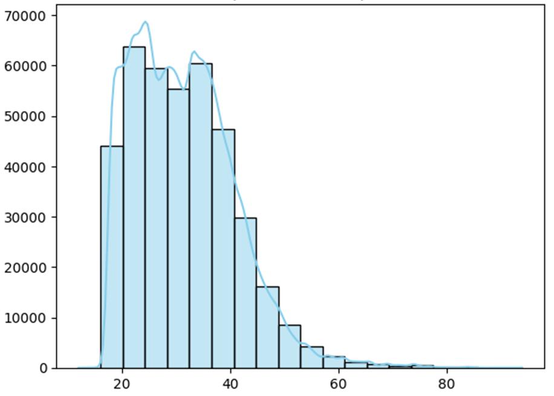
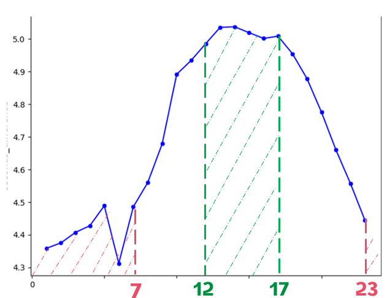
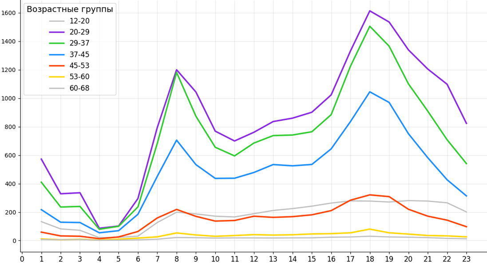
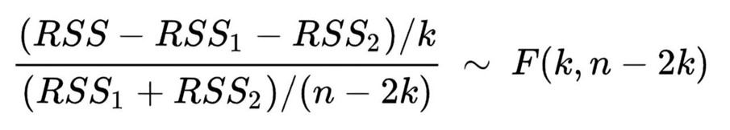
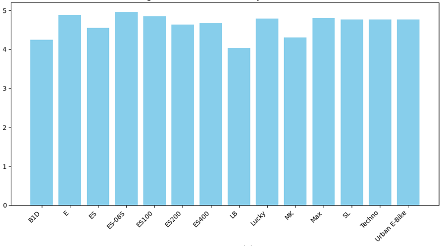
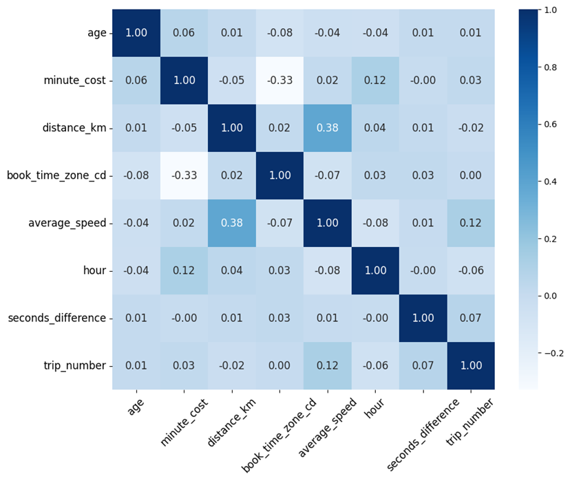
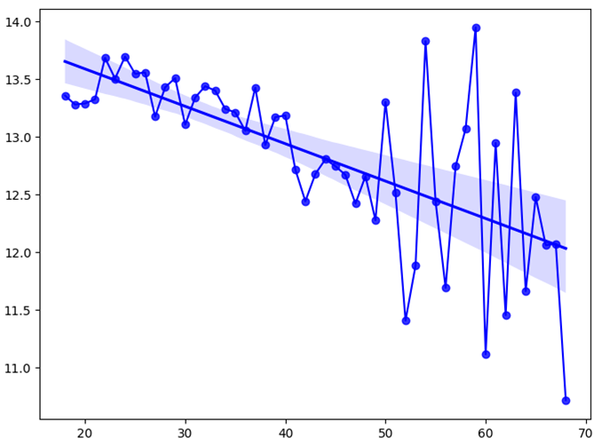
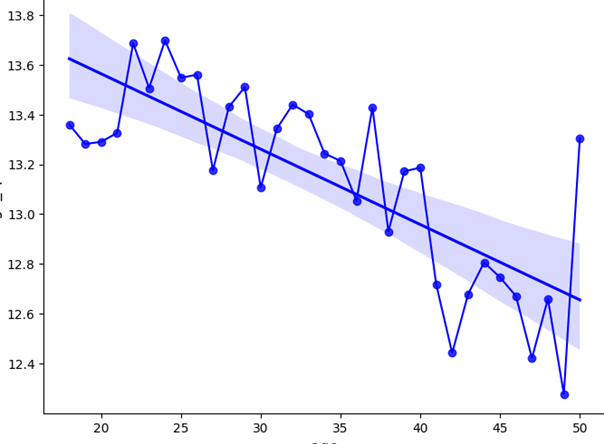
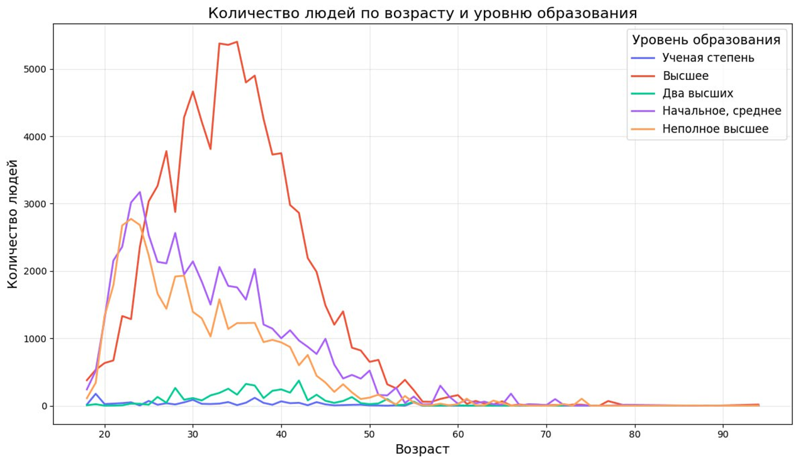

# От заказа до отправления: влияние возраста
## Проект для DANO'24 
### На основе датасета «Т-Банк: поездки на самокатах»
### NeDanoJit

---

### Структура данных
+ 396750 строк
+ Данные за сезон 2024: с апреля по октябрь
+ 71389 уникальных пользователей

Качественные переменные:
- Название модели самоката
- Пол клиента
- Уровень образования клиента
- Регион проживания человека
- Семейный статус человека

Количественные переменные:
- Стоимость минуты
- Размер суммы, которая замораживается на счете в момент взятия самоката
- Километраж поездки
- Стоимость поездки
- Размеры выплаченного кэшбэка
- Возраст клиента

### Используемые переменные 
|Переменная|Описание|
|---|---|
|order_rk|Идентификатор заказа (поездки)|
|party_rk_id|Идентификатор клиента|
|transport_model|Название модели самоката|
|distance_km|Километраж поездки|
|created_dttm|Дата и время создания заказа|
|book_start_dttm|Дата и время начала поездки|
|local_book_start_dttm|Дата и время начала поездки в часовом поясе человека, который брал самокат|
|gender_cd|Пол клиента|
|age|Возраст клиента|
|education_level_cd|Уровень образования клиента|

### Вводим новые переменные
- **travel_time_h** – время, проведённое в поездке, ч
- **average_speed**  =   *"distance_km " /"travel_time_h "*    - средняя скорость во время поездки, км/ч
- **seconds_difference**  = *"book_start_dttm − created_dttm"* – разница времени скана и времени начала поездки, с
- **hour** – час начала поездки с учётом часового пояса 
- **trip_number** – количество поездок у пользователя, совершенных на момент начала этой поездки
- **day_time** – время суток, когда была совершена поездка

### Статистика по основным количественным переменным
| |age|seconds_difference|hour|
|---|---|---|---|
|Среднее|**31.54**|6.12|12.55|
|Среднекв. откл.|9.43|19.66|5.3|
|Минимальное|12|**-1.74**|0|
|25 процентиль|24|3.64|8|
|50 процентиль|31|4.21|13|
|75 процентиль|**37**|4.97|17|
|Максимальное|**94**|**603.56**|23|

- можем заметить неравномерное распределение возрастов (75 процентиль очень далёк от максимального значение и близок к среднему)
- seconds_difference имеет отрицательное минимальное значения, что в принципе не возможно. А также максимальное значение аж в 10 раз больше среднего

### Наводим порядок:
**Удаляем выбросы (4540, 1,14%):**
1. Убираем все строки со скоростью, превышающей 40 км/ч
2. Убираем отрицательные значения seconds_difference
3. Убираем оставшиеся выбросы* с помощью метода Z-оценки

*За выбросы считаем все значения переменной за пределами трех стандартных отклонений 

#### Распределение поездок по возрасту
По графику наблюдаем очень сильный спад в количестве поездок, совершённых людьми после 50 лет. После 70 лет поездок совсем мало, кроме того их явно совершают не среднестатистические 70+ летние люди, поэтому их мы в своём исследовании просто не учитываем. Ведь это нетипепичные данные, и их совсем мало

#### Зависимость времени, потраченного на активацию самоката от часа начала поездки
Люди тратят разное время на активацию самоката в разные часы дня:
- Пик – промежуток 12:00 – 17:00. Максимальное значение seconds difference на графике =  5.037 c
- Спад – промежуток 23:00 – 7:00. Минимальное значение seconds difference на графике =  4.312 c

#### Распределение поездок по позрастным группам и часам суток
Наибольшую активность проявляют люди в группах 20-29 и 29-37. Группа 37-45 чуть меньше. При этом во всех вышеперечисленных группах чётко прослеживаются пики 8 часов и 18 часов. Вероятно, в это время люди едут на работу/учёбу и обратно соответственно. Далее группы 12-20 и 45-53 с довольно большим разрывом от вышеперечисленных. При этом в последней, хоть и менее выраженно, но также прослеживаются те же пики. Далее, снова с разрывом идут оставшиеся группы: 53-60 и 60-68. У группы помоложе всё ещё присутствуют те же пики, хоть и минимально выраженные. В то время как у самой старшей группы пики отсутствуют, видимо, потому что в этом возрасте люди уже перестают работать. 

## Исследовательский вопрос
**Как возраст клиента влияет на время между созданием заказа и началом поездки?**

## Гипотеза
**Чем старше клиент, тем больше времени проходит между созданием его заказа и началом поездки.**

### Механизм 

С возрастом люди начинают меньше торопится, количество неотложных и внезапных дел уменьшается ->
У них нет необходимости в спешке брать самокат -> 
**Время, затраченное на активацию самоката увеличивается с возрастом**

\+

Чем взрослее человек, тем в более позднем возрасте он увидел, как электросамокаты появляются на улицах ->
Тем менее он приспособлен и привык к их использованию ->
**Время, затраченное на активацию самоката увеличивается с возрастом**

### Альтернативный механизм

Вероятно, существуют другие сторонние факторы, влияющие на разницу времени старта поездки  и сканирования QR-кода.

Например, человек просто отвлёкся или вообще двигается расслабленно и просто не торопится. -> 
Потратил больше времени от сканирования QR до начала поездки

### Математическая модель
Используем метод **множественной регрессии**, чтобы рассмотреть влияния нескольких независимых переменных на одну зависимую
Используем в модели следующие переменные:
|y – зависимая переменная|x – независимые переменные|
|---|---|
|**seconds_difference** – разница во времени между сканированием QR-кода и стартом поездки|- время суток
| |-возраст 
| |-квадрат возраста
| |-количество заказов 
| |-пользователя на момент поездки|

##### Для подвыборки женщин
- R-squared: 0.003
- F-statistic: 24.84; значима на любом разумном уровне значимости
- Уровень значимости = 0.05
- RSS1 = 609521.7 

|Объясняющая переменная|coef|std error|t|p-value|
|---|---|---|---|---|
|const|4.74|0.048|36.202|0|
|age_square|0.0003|<0.01|2.84|0.005|
|age|-0.0116|0.007|-1.6|0.11|
|trip_number|0.0048|0.001|9.18|0|
|day_afternoon|0.079|0.04|2|0.046|
|day_evening|-0.046|0.04|1.3|0.193|
|day_night|-0.115|0.05|2.14|0.03|

##### Для подвыборки мужчин
- R-squared: 0.002
- F-statistic: 113.3; значима на любом разумном уровне значимости
- Уровень значимости = 0.05
- RSS2 = 3583543.5

|Объясняющая переменная|coef|std error|t|p-value|
|---|---|---|---|---|
|const|4.99|0.065|76.35|0|
|age_square|0.0003|<0.01|5.55|0|
|age|-0.0204|0.004|-5.14|0|
|trip_number|0.005|<0.01|25.4|0|
|day_afternoon|-0.006|0.016|-0.34|0.74|
|day_evening|-0.004|0.015|0.3|0.76|
|day_night|-0.005|0.02|-0.23|0.82|

#### F-статистика
F = 568.385
P-value < 0.01

k – количество зависимых переменных
n – общее количество наблюдений

**F-статистика выявила, что подмножественные регрессии лучше обьясняют данные, чем общая модель**
Таким образом регресси подмножеств не эквивалентны общей модели из-за различных коэфициентов. 

#### Различия в моделях самокатов
На уровне значимости 5% не было выявлено различий в средних значениях seconds_difference для разных моделей самокатов.
В силу этого можно сделать вывод, что полученные оценки не подвержены смещению из-за различий в моделях. 

---
### Результаты
**Наша гипотеза частично подтвердилась.**

Зависимость для женщин является квадратичной(график парабола, вершина 0, ветви вверх).

Зависимость для мужчин также является квадратичной (график парабола, вершина примерно 34, ветви вверх).

### Policy imolication
- Введение тарифа, по которому у пользователя будет дополнительное время после скана QR-кода без списывания денег. Каждые несколько лет это время можно увеличивать, тем самым улучшая пользовательский опыт
- Оптимизация таргетированной рекламы: пользователям банка в более старшем возрасте, которые показали заинтересованность в тех или иных спортивных сервисах, будет показана реклама сервиса, где упомянаются «поездки без спешки и с комфортом». 

### Ограничения и перспективы 
Ограничения:
- Данные только за сезон 2024 года
- Невозможность обобщения на весь мир
- Возможно, ложные данные (клиент соврал)
- Неполные данные (некоторые данные прсото отсутствуют)

Перспективы:
- Долгосрочная динамика
- Больше регионов
- Повышение точности данных
- Углубление

### Наша команда
- Косенкова Дарья
- Пеганова Виктория
- Миронов Маким 
- Зайцев Роман
- Парфенцев Антон

## Приложение

### Математическая модель для всех данных
- R-squared: 0.003
- F-statistic: 24.84; значима на любом разумном уровне значимости
- Уровень значимости = 0.05
- RSS2 = 4230286.7

|Объясняющая переменная|coef|std error|t|p-value|
|---|---|---|---|---|
|const|5|0.057|88ю3|0|
|age_square|0.0003|<0.01|7|0|
|age|-0.0207|0.003|-6.16|0|
|trip_number|0.005|0|26.98|0|
|day_afternoon|0.03|0.015|2|0.045|
|day_evening|-0.019|0.013|-1.4|0.168|
|day_night|-0.039|0.02|-1.87|0.06|

### Матрица корреляций 

### Зависимость средней скорости поездок от возраста клиента

возраст(>18 лет)

возраст(больше 18 лет и меньше 50)

Коэфициент корреляции = -0.04

### Образование

### ANOVA test

| |f-statistic|p-value|
|---|---|---|
|E:ES200|10.99|0|
|E:MK|6.5|0.01|
|E:Max|9.75|0|
|E:Urban E-Bike|70.06|<0.01|
|ES-08S:LB|7.48|0|
|ES-08S:Urban E-Bike|10.02|0|
|ES100:ES200|5.74|0.02|
|ES100:MK|3.92|0.05|
|ES100:Urban E-Bike|13.28|0|
|ES100:Urban E-Bike|8.77|0|
|ES200:Max|6.57|0.01|
|ES200:SL|10.45|0|
|ES200:Urban E-Bike|35|<0.01|
|LB:Lucky|4.82|0.03|
|MK:Max|4.73|0.03|
|MK:SL|6|0.01|
|MK:Urban E-Bike|14.05|<0.01|
|Max:SL|17.57|<0.01|
|Max:Urban E-Bike|99.29|<0.01|
|SL:Urban E-Bike|67.88|<0.01|
